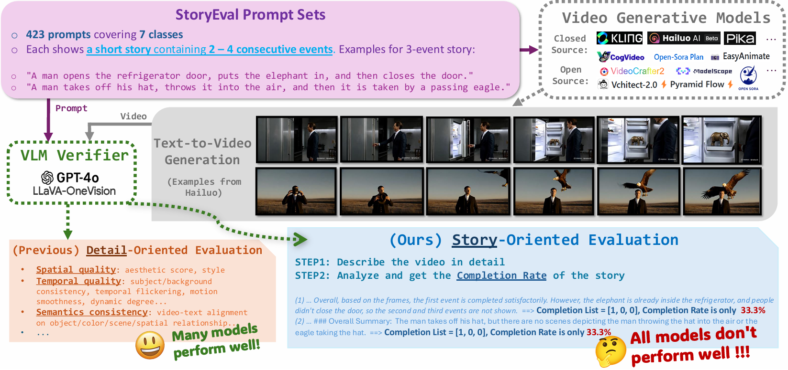
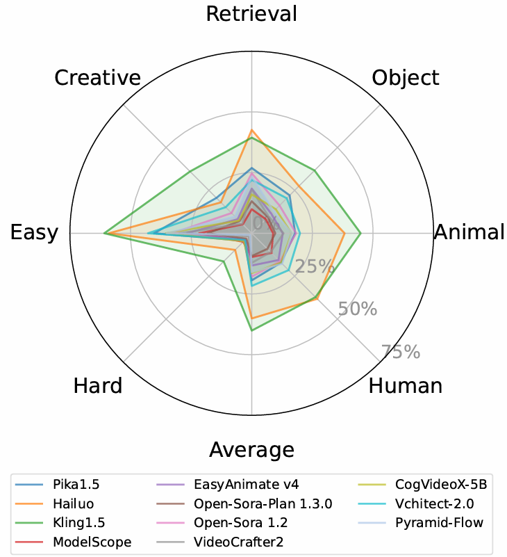

# StoryEval
A benchmark for evaluating video generative models in generating short stories.

<!-- [[Website]](https://ypwang61.github.io/project/StoryEval) 
[[Arxiv]](https://arxiv.org/abs/2412.16211) -->


[](https://ypwang61.github.io/project/StoryEval)
[](https://arxiv.org/abs/2412.16211)
[](https://drive.google.com/drive/u/0/folders/1fpvSOmPMQ0jcYyZJ0G6rweKKe-2fbATn)


[](https://github.com/ypwang61/StoryEval)
[](https://hits.seeyoufarm.com)


## Abstract

The current state-of-the-art video generative models can produce commercial-grade videos with highly realistic details. However, they still struggle to coherently present multiple sequential events in the stories specified by the prompts, which is foreseeable an essential capability for future long video generation scenarios.
For example, **top T2V generative models still fail to generate a video of the short simple story "how to put an elephant into a refrigerator."** While existing detail-oriented benchmarks primarily focus on fine-grained metrics like aesthetic quality and spatial-temporal consistency, they fall short of evaluating models' abilities to handle event-level story presentation.

To address this gap, we introduce **StoryEval, a story-oriented benchmark** specifically designed to assess text-to-video (T2V) models' story-completion capabilities. StoryEval features **423 prompts** spanning **7 classes**, each representing **short stories composed of 2–4 consecutive events**. We employ Vision-Language Models, such as GPT-4V and LLaVA-OV-Chat-72B, to verify the completion of each event in the generated videos, applying a unanimous voting method to enhance reliability. Our methods ensure high alignment with human evaluations, and the evaluation of **11 models** reveals its challenge, with **none exceeding an average story-completion rate of 50%**. StoryEval provides a new benchmark for advancing T2V models and highlights the challenges and opportunities in developing next-generation solutions for coherent story-driven video generation.


## News
 * `2024.12.17`  🚀🚀 [StoryEval paper](https://arxiv.org/abs/2412.16211) is submitted to arXiv!
 * `2024.12.16`  🚀🚀 Release the [project website](https://ypwang61.github.io/project/StoryEval)!
 * `2024.12.14`  🚀 Add StoryEval prompts!

## Example
 Top T2V generative models still fail to completely present videos containing consecutive short stories, like ''how to put an elephant into a refrigerator.'' (containing 3 events: opening the refrigerator door, putting the elephant in, and closing the refrigerator door.)
 
 Completion list denotes if each event is completed (1) or not (0). More demos are available in [project website](https://ypwang61.github.io/project/StoryEval).

<video src="./assets/videos/elephant.mp4"></video>


## Evaluation Results

Presenting stories that containing consecutive events is still a challenging task. None of the 11 text-to-video models exceeds an average story-completion rate of 50% on our StoryEval.

<p align="center">
  
</p>


## Process
### Installation
The package used in our experiment is the same as that in [LLaVA-NeXT](https://github.com/LLaVA-VL/LLaVA-NeXT).
<!-- , the only difference is that we use `opencv-python-headless` and add `"typing_extensions`. -->
```
cd LLaVA-NeXT
conda create -n llava python=3.10 -y
conda activate llava
pip install --upgrade pip
pip install -e ".[train]"
cd ..
```
### Unified Name of Generated Videos
To evaluate a new text-to-video generative model, we can use the 423 prompts from `prompts/all_prompts.txt` to generate evaluation videos. We require the name of generated videos to be determined by the `sentence_to_filename` function in `utils.py`. For example, the filename of prompt 'xxx' should be 
```
sentence_to_filename('xxx') + '.mp4'
```
Actually in **`prompts/all_prompts.json`**, the key of each entry/prompt is the corresponding file name. More details about each prompt is also available in this file.

Furthermore, given a new model named X, please put all the generated videos in the directory:
```
generated_videos/X/
```
Refer to the example videos from hailuo and pika1.5 for details.

### Evaluation
Run evaluation by the following script:
```
./evaluate.sh
```
This script supports debug mode (2 videos) and full mode (423 videos), including two kinds of verifiers (GPT-4o or [LLaVA-OV-Chat-72B](https://huggingface.co/lmms-lab/llava-onevision-qwen2-72b-ov-chat)).
The result will be stored in the `results` directory.

Please add the GPT-4o information in `evaluate.sh` for GPT-4o evaluation. And for LLaVA evaluation, we require at least four 49G GPUs for loading the LLaVA-OV-Chat-72B model.

The complete evaluation output files in [our paper](https://arxiv.org/abs/2412.16211) have been shown in `full_results` directory.


### Choose a subset
If you aim to evaluate on a subset of the prompts, you can create a new json file in the `prompts/` directory for the subset, and run  `json2txt.py` to obtain the txt file. For example for `prompts/prompts_debug.json`, we can run
```
python json2txt.py --prompt_file_name prompts_debug
```

Please refer to our paper for more details about the evaluation process.

## Citation

   If you find our work useful for your research, please consider citing our paper:

   ```bibtex
    @article{wang2024storyeval,
        title={Is Your World Simulator a Good Story Presenter? A Consecutive Events-Based Benchmark for Future Long Video Generation},
        author={Wang, Yiping and He, Xuehai and Wang, Kuan and Ma, Luyao and Yang, Jianwei and Wang, Shuohang and Du, Simon Shaolei and Shen, Yelong},
        journal={arXiv preprint arXiv:2412.16211},
        year={2024}
    }
   ```